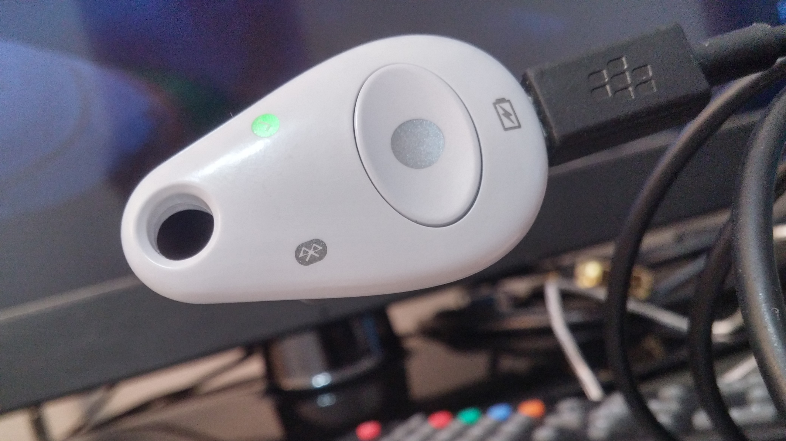

# Feitian MultiPass FIDO U2F (K13)

Will likely be sold under other brand names as well.

## Useful NFC Info

```
Version: 4.21.171
Title: NXP Semiconductors SmartMX (P5CD081 or P5CD041) tag with NXP JCOP v2.4.2 R1

Application Info:
Global Platform card manager present
FIDO U2F app
Visa card manager

Supported interfaces:
‣ ISO/IEC 14443 (contactless)
‣ ISO/IEC 7816-3 (contact)
Coprocessors: 3DES, AES, FameXE (Public key)
MIFARE Classic emulation

Global Platform information:
Java Card version 2.2
Global Platform version 2.1.1
GP Secure Channel Protocol: 02 option 55
Max. length APDU data field: 255 bytes
Visa card manager

Card Production Life Cycle data (CPLC):
IC Fabricator: NXP (0x4790)
IC Type: SmartMX (0x5168)
OS ID: JCOP (0x4791)
OS release date: 2011/07/29 (0x1210)
OS release level: 0x3800
IC Fabrication Date: 2016/06/08 (0x6160)
IC Batch Identifier: 0x8305
IC Module Fabricator: NXP (0x4812)
IC Module Packaging Date: [invalid] (0x7575)
ICC Manufacturer: [not set] (0x0000)
IC Embedding Date: [not set] (0x0000)
IC Personalizer: [not set] (0x0000)
IC Personalization Date: [not set] (0x0000)
IC Perso. Equipment ID: 0x00000000
IC Personalizer: [unknown] (0x0000)
IC Personalization Date: [not set] (0x0000)
IC Perso. Equipment ID: 0x00000000

Fabkey ID: 0x03
Patch ID: 0xB1
Target ID: SmartMX (0x01)
Mask ID: 0x38 (mask56)
Custom mask ID: Generic (0x00000000)
Mask name: NX130A (0x4E5831333041)
Fuse state: fused (0x01)
ROM info: 0xC310EA (length: 3 bytes)
Combo name: smartmx-m38.03.b1-NX130A

Default selected AID:
FIDO U2F app
0x5532465F5632 |U2F_V2|

ISO/IEC 7816-4 compatible
ISO/IEC 14443-4 (Type A) compatible
ISO/IEC 14443-3 (Type A) compatible
ISO/IEC 14443-2 (Type A) compatible

Max. accepted frame size: 256 bytes (FSCI: 8)
‣ Supported receive rates:
• 106, 212, 424, 848 kbit/s (DR: 1, 2, 4, 8)
‣ Supported send rates:
• 106, 212, 424, 848 kbit/s (DS: 1, 2, 4, 8)
‣ Different send and receive rates not supported
‣ SFGT: 604.1 µs  (SFGI: 1)
‣ FWT: 618.6 ms  (FWI: 11)
‣ NAD not supported
‣ CID supported
‣ Historical bytes: 0x41373030354347203234325231 |A7005CG 242R1|
```

## USB
```
ePass FIDO:

  Product ID:	0x085a
  Vendor ID:	0x096e
  Version:	32.03
  Speed:	Up to 12 Mb/sec
  Manufacturer:	FS
  Location ID:	0x14110000 / 3
  Current Available (mA):	500
  Current Required (mA):	100
  Extra Operating Current (mA):	0
```

```
Attestation Certificate
Certificate:
    Data:
        Version: 3 (0x2)
        Serial Number:
             (Negative)<removed>
    Signature Algorithm: ecdsa-with-SHA256
        Issuer: CN=FT FIDO 0100
        Validity
            Not Before: Apr 15 15:00:00 2016 GMT
            Not After : Apr 15 15:00:00 2026 GMT
        Subject: CN=FT FIDO U2F <removed>
        Subject Public Key Info:
            Public Key Algorithm: id-ecPublicKey
                Public-Key: (256 bit)
                pub: 
                    <removed>
                ASN1 OID: prime256v1
        X509v3 extensions:
            1.3.6.1.4.1.45724.2.1.1: 
                ...`
    Signature Algorithm: ecdsa-with-SHA256
         <removed>
-----BEGIN CERTIFICATE-----
<removed>
-----END CERTIFICATE-----
```

## Other Notes

- NFC seems to be extremely weak, difficult to use with Android
- At the time of writing, U2F BLE is not usable (zero browsers support it)
- USB works fine
- If you start it in Bluetooth mode, you can plug it into USB after
